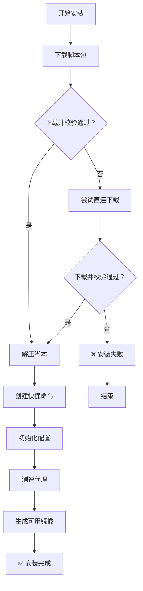
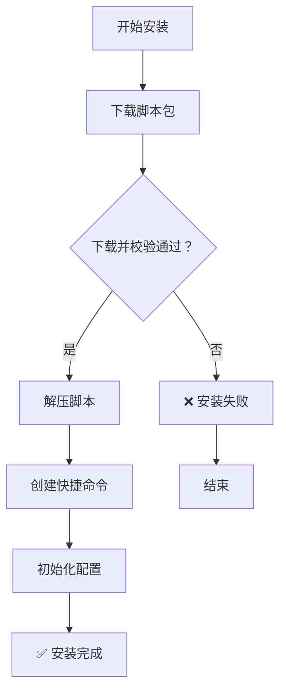

# 专用于 OpenWrt 的小型 Tailscale 一键安装工具

[](https://github.com/CH3NGYZ/small-tailscale-openwrt/releases/latest)
[](https://github.com/CH3NGYZ/small-tailscale-openwrt/releases/latest)
[](https://github.com/CH3NGYZ/small-tailscale-openwrt)
[](https://github.com/CH3NGYZ/small-tailscale-openwrt/stargazers)

#### For English documentation, see [README_EN.md](https://github.com/CH3NGYZ/small-tailscale-openwrt/blob/main/README_EN.md).

### 脚本目前只在下列系统上测试通过, 其他系统请自测, 可能还有点小 bug, 如发现问题请及时提 [issue](https://github.com/CH3NGYZ/small-tailscale-openwrt/issues/new) 反馈~
- x86_64
  - [iStoreOS-24.10.4-2025102410](https://site.istoreos.com/firmware/download?devicename=x86_64&firmware=iStoreOS)
  - [EzOpWrt-Vip-Super-202510010716-6.6.106](https://github.com/sirpdboy/openwrt?tab=readme-ov-file#%E5%9B%BA%E4%BB%B6%E4%B8%8B%E8%BD%BD)

## 📦 仓库文件结构

```
├── install.sh                    # 安装脚本包到本地
├── pretest_mirrors.sh             # 第一次安装测速代理池的脚本
├── tailscale-openwrt-scripts.tar.gz  # 本仓库的Scripts目录下的脚本压缩包
└── scripts
    ├── autoupdate.sh              # 自动更新脚本
    ├── fetch_and_install.sh       # 获取并安装脚本
    ├── github_direct_ctl.sh       # 切换直连或代理设置脚本
    ├── helper.sh                  # 辅助脚本
    ├── notify_ctl.sh              # 通知设置脚本
    ├── setup_cron.sh              # 设置定时任务脚本
    ├── setup_service.sh           # 设置服务脚本
    ├── setup.sh                   # 安装tailscale脚本
    ├── tailscale_up_generater.sh  # 生成tailscale up命令脚本
    ├── test_mirrors.sh            # 测试镜像脚本
    ├── tools.sh                   # 公共脚本
    └── uninstall.sh               # 卸载脚本
    └── update_ctl.sh              # 自动更新设置脚本

```

## 🚀 快速安装

### 1.下载管理工具 & 排序代理池

```bash
# 代理版
 rm -rf /etc/tailscale /tmp/tailscale-use-direct /tmp/install.sh
 URL="https://ghproxy.05160715.xyz/https://github.com/HTT0715/small-tailscale-openwrt/blob/main/install.sh"
 (command -v curl >/dev/null && curl -fSL "$URL" -o /tmp/install.sh || wget "$URL" -O /tmp/install.sh) || { echo 下载失败; exit 1; }
 sh /tmp/install.sh || { echo 执行失败; exit 1; }
  
```

##### 请注意, 如果您开启了代理，下载及更新可能会出现网络问题，可以尝试使用下方的直连命令安装:

```bash
# 直连版
 rm -rf /etc/tailscale /tmp/install.sh
 touch /tmp/tailscale-use-direct
 URL="https://github.com/HTT0715/small-tailscale-openwrt/blob/main/install.sh"
 (command -v curl >/dev/null && curl -fSL "$URL" -o /tmp/install.sh || wget "$URL" -O /tmp/install.sh) || { echo 下载失败; exit 1; }
 sh /tmp/install.sh || { echo 执行失败; exit 1; }
  
```

### 2.启动管理工具

```bash
tailscale-helper
```

### 流程图:

<table style="width: 100%;"><tr><td style="width: 50%;"> <details> <summary><strong>代理版流程图</strong></summary>
   


</details> </td> <td style="width: 50%;"> <details> <summary><strong>直连版流程图</strong></summary>
   


</details> </td> </tr> </table>

## 🛠️ 管理工具说明

`tailscale-helper` 命令进入交互式管理界面，提供以下功能：

1. 💾 **安装 / 重装 Tailscale**：运行安装脚本来安装或重装 Tailscale。
2. 📥 **登录 Tailscale**：执行 `tailscale up` 命令并监听登录 URL 输出。
3. 📝 **生成启动命令**：交互式生成所需的参数和 `tailscale up` 命令。
4. 📤 **登出 Tailscale**：执行 `tailscale logout` 并检查状态。
5. ❌ **卸载 Tailscale**：清理并卸载 Tailscale。
6. 🔄 **管理自动更新**：配置本地或临时模式的自动更新策略。
7. 🔄 **手动运行更新脚本**：立即执行自动更新脚本。
8. 🔄 **切换 GitHub 直连/代理**：在使用直连或代理之间切换。（仅限中国用户）
9. 📦 **查看本地版本**：检查当前安装的 Tailscale 版本。
10. 📦 **查看远程版本**：获取并显示可用的最新 Tailscale 版本。
11. 🔔 **管理推送通知**：配置 Server酱 / Bark / NTFY 通知。
12. 📊 **排序代理池**：测试代理的可用性并排序。（仅限中国用户）
13. 🛠️ **更新脚本包**：从 GitHub 获取最新的管理脚本并自动更新。
14. 📜 **查看更新日志**：查看与 Tailscale 启动或更新相关的日志。
15. ⛔ **退出**：退出管理工具。

## 🔔 通知系统
支持 Server酱、Bark 和 NTFY 通知方式：

配置选项包括：

- 更新通知：版本升级成功/失败时提醒
- 代理失败：检测代理都不可用时提醒

## ⚠️  注意事项
1. 内存安装模式每次重启后需重新下载 Tailscale
2. 由于代理不稳定，可能出现下载失败，建议使用本地安装模式
3. 首次使用建议配置通知功能
4. 需要至少 curl 或 wget 之一才能正常使用

## 💬 联系方式

- 如有问题或建议，请提交 issue 或 email 至 github@ch3ng.top

## 😍 鸣谢
   1. [glinet-tailscale-updater](https://github.com/Admonstrator/glinet-tailscale-updater)
   2. [golang](https://github.com/golang/go)
   3. [UPX](https://github.com/upx/upx)
   4. 本项目CDN由 [Tencent EdgeOne](https://edgeone.ai/?from=github) 提供. CDN acceleration and security protection for this project are sponsored by [Tencent EdgeOne](https://edgeone.ai/?from=github).


## Star History
[](https://www.star-history.com/#CH3NGYZ/small-tailscale-openwrt&Date)

